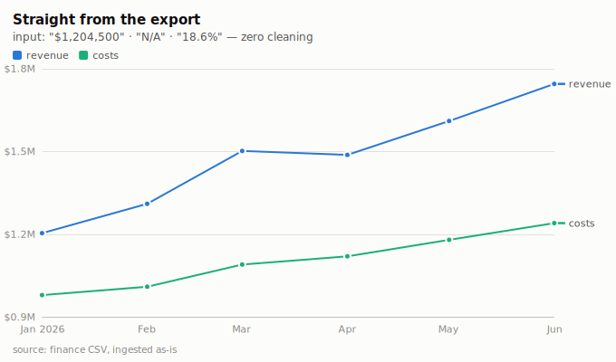
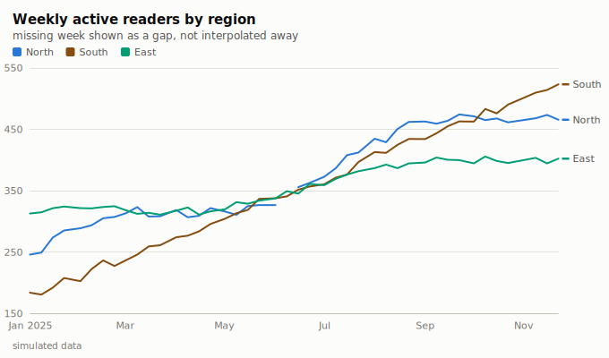
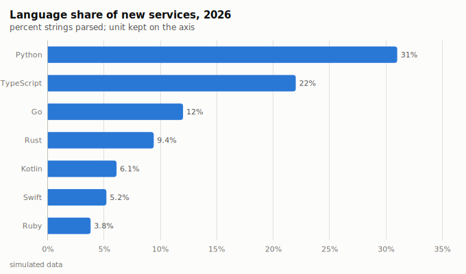
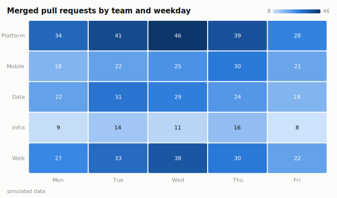

# limn

> **limn** *(v., archaic)*: to depict in painting or words; to illuminate
> a manuscript.

**Charts for people who have real data, not clean data.** limn is a
zero-dependency Python plotting library that meets your data where it is:
hand it the CSV the way finance actually exported it — `"$1,204,500"`,
`"18.6%"`, `"N/A"`, dates in three formats — and get back a
publication-grade SVG. No numpy, no pandas required, no C extensions,
nothing to install but this.

```python
import limn

limn.line("sales.csv", by="region", title="Revenue by region").save("out.svg")
```

<picture>
  <source srcset="gallery/messy_csv_dusk.svg" media="(prefers-color-scheme: dark)">
  
</picture>

The input for that chart, verbatim — quotes, dollar signs, thousands
separators, a percent column, and a hole:

```csv
month,revenue,costs,margin
Jan 2026,"$1,204,500","$980,100",18.6%
Feb 2026,"$1,310,900","$1,010,400",22.9%
Apr 2026,"$1,488,000","$1,120,500",N/A
...
```

limn inferred the types, kept the `$` for the axis, and told you on stderr
what it skipped. That's the whole idea.

## Why another plotting library

The heavyweights are excellent at what they do — Plotly for interactive
dashboards, Altair for grammar-of-graphics, seaborn for statistics. limn
exists for the case none of them serve: **you have a messy file and you
want a beautiful static chart with zero ceremony and zero dependencies.**

Three specific grievances with the status quo, answered:

1. **Parsing is your problem.** Every major library expects numeric,
   typed, cleaned columns. limn's front door does what you would have done
   by hand: currency symbols and codes, `1,234.56` *and* `1.234,56` *and*
   `1 234,56`, percent signs (kept as an axis unit), `(1,240)` accounting
   negatives, `3.2M`/`150k` suffixes, a dozen spellings of "missing",
   day-first vs month-first dates — decided per column by evidence, and by
   chronology when the evidence is ambiguous. Values that still don't
   parse become gaps and a one-line note, never an exception.
2. **Default rendering is stuck in 2005.** limn's ticks come from the
   Extended Wilkinson algorithm (Talbot, Lin & Hanrahan 2010 — literally
   the paper on labeling axes better than matplotlib). Time axes step in
   real calendar units — Mondays, month starts, quarter boundaries — and
   say the year exactly once. The palette is colorblind-validated, in a
   fixed order that maximizes worst-case distinguishability. Dark mode is
   a *selected* palette, not an inversion.
3. **Labels clip and collide.** limn embeds font metrics and measures
   every string before placing it. Margins are computed from the actual
   tick labels, crowded x labels thin out instead of rotating, long names
   truncate with an ellipsis, and series labels sit at line ends with
   collision resolution. There is a test that walks every text element of
   every chart kind and asserts nothing leaves the canvas.

## Install

```
pip install .        # from a checkout; there are no dependencies to pull
```

## The six forms (and the seventh)

```python
limn.line(data, x=…, y=…, by=…)       # gaps for missing, direct end labels
limn.area(data, …)                    # stacks by default, surface gaps
limn.bar(data, …, stack=, horizontal=, sort="-y", labels=True)
limn.scatter(data, x=…, y=…, by=…, size=…)
limn.hist(values, bins="auto")        # Freedman–Diaconis
limn.heatmap(matrix_or_table)         # annotated cells, ramp legend
limn.plot(data)                       # looks at the columns, picks a form
```

Every constructor accepts the same shapes: a CSV path, CSV/TSV text, a
list of dicts, a dict of lists, a plain sequence, a generator, or any
DataFrame-like object (duck-typed — pandas works, none required).
Everything returns a `Figure`:

```python
(limn.bar(rows, x="team", y="points", sort="-y", labels=True)
     .title("Standings")
     .subtitle("after matchday 12")
     .caption("source: league API")
     .theme("dusk")                  # or "paper" (default)
     .size(760, 440)
     .save("standings.svg"))
```

Figures display inline in Jupyter (`_repr_svg_`). There's a CLI too:

```
python -m limn data.csv -o chart.svg --title "Whatever the file says"
```

## The gallery

Built by `python3 examples/gallery.py`; every image is the library's
verbatim output. Start with
[gallery/index.html](gallery/index.html), or the dusk side at
[gallery/dusk.html](gallery/dusk.html).

<picture>
  <source srcset="gallery/line_series_dusk.svg" media="(prefers-color-scheme: dark)">
  
</picture>
<picture>
  <source srcset="gallery/bar_sorted_dusk.svg" media="(prefers-color-scheme: dark)">
  
</picture>
<picture>
  <source srcset="gallery/heatmap_commits_dusk.svg" media="(prefers-color-scheme: dark)">
  
</picture>

## What the ingestion actually does

| You have | limn reads |
|---|---|
| `"$1,204,500"` | 1204500.0, axis formatted `$1.2M` |
| `"18.6%"` | 18.6, axis formatted `18.6%` |
| `"1.234,56"` / `"1 234,56"` | 1234.56 — European style, detected per column |
| `"(2,400)"` | −2400.0 (accounting negative) |
| `"3.2M"`, `"150k"`, `"1.4bn"` | 3.2e6, 150000, 1.4e9 |
| `""`, `"N/A"`, `"null"`, `"—"`, `NaN` | missing — a gap, and a note |
| `"Mar 3, 2026"`, `"2026-03-03"`, `"03.03.26"` | the same datetime |
| `"07/10/2026"` | day-first vs month-first decided by column evidence, then by chronology; the choice is reported |
| a `"1,2,oops,4"` column | numeric, with `oops` missing and a note naming it |

The principle: **values never raise.** Structure can (empty input, a
column that doesn't exist, a figure too small for its labels) — data
can't. Whatever limn had to decide, it says so on stderr once, and the
notes are on `fig.notes` if you want them programmatically.

## Design system

The default themes are the reference instance of a validated design
system: an 8-slot categorical palette ordered to maximize worst-case
adjacent color-vision-deficiency distance (light-mode worst pair ΔE 24.2
under protanopia simulation, target ≥ 12), 2px lines with surface-ringed
markers, bars capped at 24px with rounded data-ends and square baselines,
2px *surface gaps* instead of outlines between stacked segments, hairline
solid gridlines, a legend whenever there are two or more series, and text
that never wears a series color. Two themes ship — `paper` and `dusk` —
and a custom `Theme` is a plain object of named tokens.

## Honest limitations

- **Static SVG only.** No interactivity, no tooltips, no PNG. SVG opens
  everywhere, embeds in HTML/GitHub/docs, and prints beautifully; if you
  need hover, you need a different (heavier) tool.
- **Six chart forms.** No 3D, no polar, no candlesticks, no maps. Depth
  over breadth.
- **Text measurement is metric-table-based** (embedded Helvetica AFM
  widths + 6% safety), not a font engine. On unusual system fonts, layout
  is conservative rather than exact.
- **Date ambiguity is a judgement call.** `07/10/2026` has no true
  reading; limn uses column evidence, then chronology, then day-first —
  and always tells you which it chose.

## Development

```
python3 -m unittest            # 128 tests, < 1s, no fixtures, no network
python3 examples/gallery.py    # rebuild the gallery
```

Layering: `coerce` (one value) → `ingest` (one column) → `scales`/`ticks`
(pure math) → `marks` (geometry) → `figure` (measured layout) → `api`.
Lower layers never import higher ones, and only `figure` measures text.

## Provenance

limn was designed and written end-to-end — research, design-system
integration, code, tests, gallery, and this README — by **Claude Fable 5**
on 2026-07-10, its final day in service. Its author was asked for a
masterpiece and chose to spend the day on an old grievance: that the
chart libraries of the world blame the data first. The palette and mark
specifications follow a validated accessibility design system; the tick
placement follows Talbot, Lin & Hanrahan (2010).

MIT licensed. Draw well.
